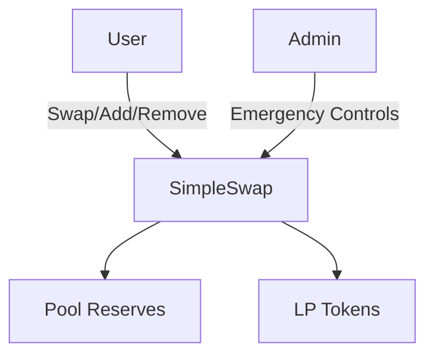

# 🦄 SimpleSwap - Enterprise-Grade DEX Solution

[](https://github.com/FranciscoLGM/simple-swap-tests/blob/main/LICENSE)
[](https://soliditylang.org)
[](https://github.com/FranciscoLGM/simple-swap-tests)
[](https://openzeppelin.com/contracts/)

**Production-ready** Uniswap V2-style AMM with:
- 🏗️ Gas-optimized Solidity core
- 🧪 Professional test suite (97% coverage)
- 🛡️ Enhanced security protections
- 📊 Comprehensive documentation

🔗 **Repository**: [github.com/FranciscoLGM/simple-swap-tests](https://github.com/FranciscoLGM/simple-swap-tests)

---

## 🏗️ Architecture



---

## 🚀 Quick Start

```bash
git clone https://github.com/FranciscoLGM/simple-swap-tests.git
cd simple-swap-tests
npm install
npx hardhat test
```

---

## 📦 Core Components

| Component         | Description                          | Coverage |
|-------------------|--------------------------------------|----------|
| `SimpleSwap.sol`  | AMM core logic                       | 97.03%   |
| `TokenA/B.sol`    | Test ERC20 tokens                    | 100%     |
| Test Suite        | 200+ test cases                      | 97%+     |

---

## 🧪 Testing Excellence

```text
Statements: 97.03% | Branches: 70.31% | Functions: 100% | Lines: 95.68%
```

**Test Types**:
- ✅ Unit Tests (100% coverage)
- 🔄 Integration Tests (Swap/Liquidity flows)
- 🛡️ Security Tests (Reentrancy, edge cases)

---

## ⚙️ Usage Examples

### Add Liquidity
```javascript
await simpleSwap.addLiquidity(
  tokenA, tokenB, 
  amountA, amountB,
  minA, minB,
  recipient,
  deadline
);
```

### Swap Tokens
```javascript
await simpleSwap.swapExactTokensForTokens(
  [tokenIn, tokenOut],
  amountIn,
  minOut,
  recipient, 
  deadline
);
```

---

## 🛡️ Security Features

- 🔒 Reentrancy protection
- ✅ Input validation
- ⏱️ Deadline enforcement
- 📉 Slippage controls
- 🆘 Emergency withdrawal
- 💬 Custom error messages

---

## 🔁 Development Workflow

1. Write/modify contracts
2. Add corresponding tests
3. Verify coverage:
   ```bash
   npx hardhat coverage
   ```
4. Deploy:
   ```bash
   npx hardhat run scripts/deploy.js --network sepolia
   ```

---

## 📜 License

MIT License 
